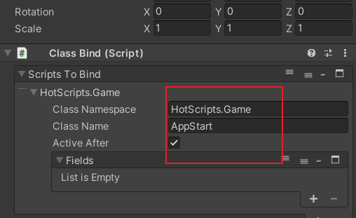
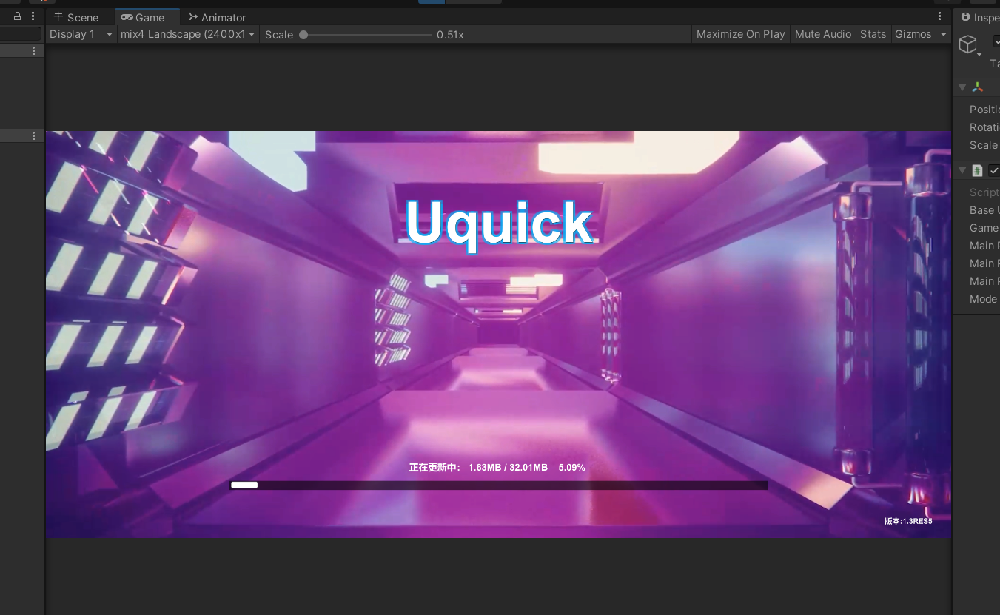
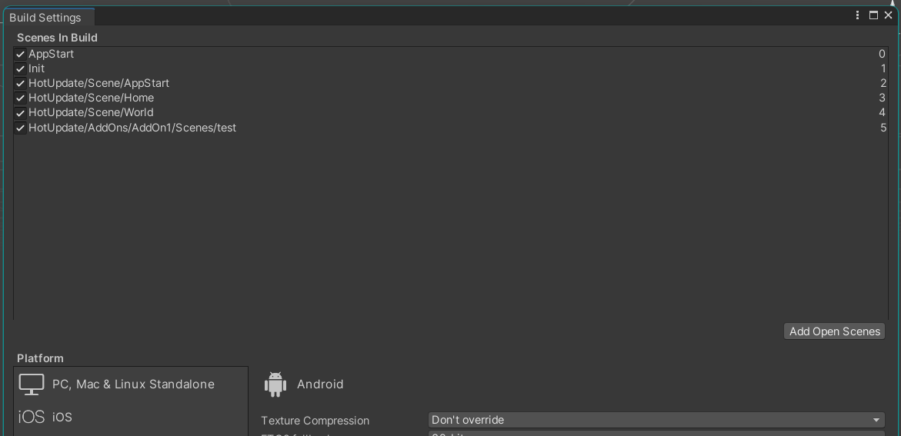
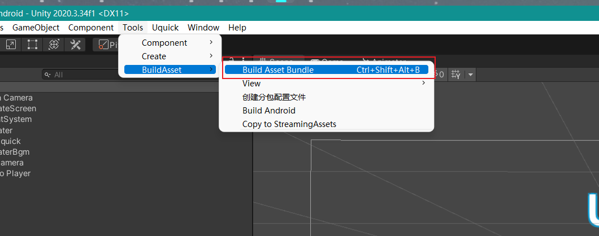
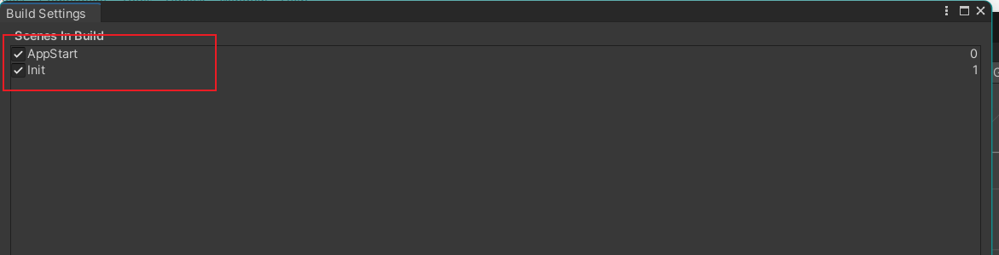
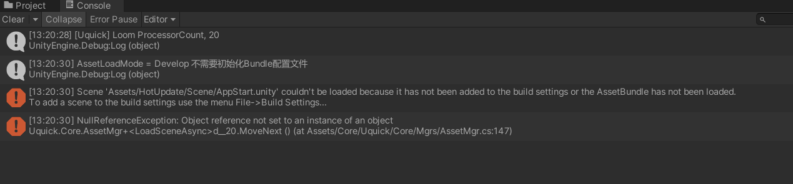
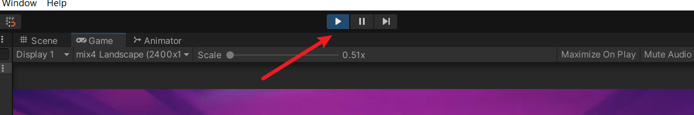

# 快速开始

这里以安卓项目为例子，其他平台的也类似。这里例子会编译打包上线整个Demo，如果MMO Demo服务端没有搭建，请查看[服务端快速开始](https://github.com/i0gan/Squick/blob/main/docs/quick_start.md)，如果只想使用冷热更新功能，可以忽略MMO Demo的服务端搭建过程，将其Demo代码，场景还有资源删除即可。

### 打开项目

1. 将项目的**Unity目录用Unity打开**
2. 可直接点击运行Demo，如果出现报错，可能是Unity版本比较新或者比较老，推荐采用Unity 2020.03.x版本进行打开。


查看控制台，出现打印了Hello World!


这条语句的输出是在热更脚本里输出的。


### 修改热更脚本

打开热更工程，也就是`Uquick/Unity/HotScripts`目录，用IDE（推荐vs或rider）打开里面的sln文件，打开Game/AppStart.cs文件，在里面Awake增加你的日志，然后编译。默认该脚本Awake里有个`Debug.Log("Hello World! 这里执行的是热更代码");`，在热更完毕进入`Assets/HotUpdate/Scene/AppStart.unity` 场景后会调用该函数，该脚本文件绑定在此场景中的AppStart对象上，采用Class Bind脚本来绑定热更脚本的。如下：



你可以自行在`Uquick/Unity/HotScriptsGame/AppStart.cs`代码里增加打印日志，测试一下热更脚本的执行。


### 编译热更资源

将热更脚本还有热更资源全部编译为Unity的Asset Bundles文件，这里编译出来的文件是以.so (stream object) 结尾。

打包热更资源，点击`Tools/BuildAsset/Build Asset Bundle`

点击之后，可以点击`Tools/BuildAsset/View/Build`查看编译好的资源所在位置。在该目录下回出现Main、AddOn1等目录。


### 修改 MMO Demo服务端IP

打开服务端的`Assets/Resources/Config.xml`，将 第一个ip修改为你搭建Squick服务端的ip地址，默认为`1.14.123.62`。该ip地址为公网地址，如果懒得搭建服务端，可暂时使用该ip地址。


### 修改热更资源服务器ip

修改热更资源服务器IP，打开Assets/Init.unity场景，选择Updater对象，属性面板中出现BaseURL中，将其填写为你的资源服务器，比如`http://ip:port/dlc/`，默认为`http://ble.pwnsky.com:22220/dlc/`。相当于在服务器的/dlc目录下，存储的是热更资源文件。


### 部署热更资源服务

#### go部署

如果自己能部署静态Web服务，可以忽略该部分，这里服务器以Linux为例

```
sudo mkdir -p /srv/uquick/updater/www/dlc
```

将其web服务root路径部署在/srv/uquick/updater/www/，Web服务器可以用nginx或者apache，如果不想去配置这些玩意儿，可以通过go编译一个静态web服务器，如果你喜欢python或者php、java这些都可以自行写一个部署。

go代码如下：[go静态服务器代码下载](https://raw.githubusercontent.com/i0gan/Squick/main/src/tools/http_server/https.go)

```go
/*
    https 静态服务器
*/
package main
import (
    "net/http"
    "os"
    "fmt"
    "github.com/gin-gonic/gin"
)
func Help() {
    fmt.Println("https 1.0\n[www_path] [http/https] [:port] [crt_path] [key_path]")
    fmt.Println("Example:")
    fmt.Println("sudo ./https ./www http :80")
    fmt.Println("sudo ./https ./www https :443 ./server.crt ./server.key")
}


func main() {
    args := os.Args
    if args == nil || len(args) < 4 {
        Help()
        return
    }


    gin.SetMode(gin.ReleaseMode) //线上环境
	router := gin.Default()
	//router.Use(Middleware)
    router.StaticFS("/", http.Dir(args[1])) 
    fmt.Printf("Server Running\n WWW ROOT: %s \n LISTEN ON %s\n PROTOCOL: %s \n", args[1], args[3], args[2])
    


    if(args[2] == "http") {
        fmt.Println("protocl: http")
        err := http.ListenAndServe(args[3], router)
        if err != nil {
            fmt.Println("Error: ", err)
        }
    }else if(args[2] == "https") {
        if args == nil || len(args) < 6 {
            Help()
            return
        }
        
        fmt.Println("protocl: https")
        err := http.ListenAndServeTLS(args[3], args[4], args[5], router)
        if err != nil {
            fmt.Println("Error: ", err)
        }
    }
}

func Middleware(c *gin.Context) {
    c.Header("Access-Control-Allow-Origin", "http://127.0.0.1:8080/, http://tflash.pwnsky.com:8888")
	c.Header("Access-Control-Allow-Headers", "Content-Type,Access-Token,X-CSRF-Token, Authorization")
	c.Header("Access-Control-Allow-Methods", "POST, GET, OPTIONS, PUT")
	c.Header("Access-Control-Expose-Headers", "Content-Length, Access-Control-Allow-Origin, Access-Control-Allow-Headers, Content-Type")
	c.Header("Access-Control-Allow-Credentials", "true")
    method := c.Request.Method
    if method == "OPTIONS" {
		c.AbortWithStatus(http.StatusOK)
	}
    c.Next()
}
```

编译

```bash
# 下载依赖
go mod init i0gan/Squick
go mod tidy
# 编译
go build https.go
```

https运行参数如下：

```bash
https 1.0
[www_path] [http/https] [:port] [crt_path] [key_path]
Example:
sudo ./https ./www http :80
sudo ./https ./www https :443 ./server.crt ./server.key
```

编译完毕后，会出现https

```bash
sudo mkdir -p /srv/uquick/bin
sudo cp https /srv/uquick/bin
/srv/uquick/bin/https /srv/uquick/updater/www http :22220
```

以上就行将`/srv/uquick/updater/www`部署为一个web服务的root目录，监听断开为22220，注意前面端口号前有冒号`:`。

将热更资源文件以及apk文件 (Build下的所有文件)上传自http服务器，上传Build中的所有文件即可。保证http的根目录下有目录。

部署完毕后，将Build下的所有文件上传至`/srv/uquick/updater/www/dlc`目录下。

tips:

在Unity工程目录下，也提供了一个上传资源的脚本 `upload.sh`，修改该脚本路径以及域名或ip上传至服务器中，方便以后更新，直接运行脚本即可。


### 部署测试

部署完毕后可以采用编辑器来看看热更有没有生效，打开Assets/Init.unity场景，选择Updater对象，点击Mode中的选项，改为Build。点击运行，看看有没有出现热更过程。



出现以上界面，说明热更服务配置正确了，如果还有任何问题，请入群讨论。


### 打包apk

1. 执行CLR绑定（菜单栏，`Uquick/ILRuntime/CLR Bind`），这一步不做的话在打包IL2CPP后可能会出问题
2. 打包游戏（APK）点击`Tools/BuildAsset/Build Android`在Unity项目下的Build目录下会出现application.apk、version，还有些热更资源文件

采用手机安装运行看看效果。如果能够实现热更过程并顺利进入demo运行，恭喜你，你已经入门Uquick了，之后就可以将自己的热更资源丢入Assets/HotUpdate/下对应的目录了，采用热更脚本来实现资源的管理和游戏逻辑。


### 安卓打包发布版本推荐

在打包Release版本时，为了优化性能与减少安装包大小，请将mono改为IL2CPP，架构为armv8，然后做一下执行CLR绑定（菜单栏，`Uquick/ILRuntime/CLR Bind`）。


## 打包注意的问题

目前除了安卓平台，还没其他平台提供一键打包菜单栏，需要手动通过Unity Build来打包。例如在Windows打包，需要注意保证场景中之后两个场景，分别是 AppStart和Init场景。其他场景均为热更场景，不需要打包至EXE中。比如有时候会出现



我们点击一下菜单栏`Tools/BuildAsset/Build Asset Bundle`



该操作会打包热更资源，以及在编译设置中剔除热更场景，之后再查看编译设置(Build Settings)如下：



会发现只有两个场景了，这时候可以安心的点击Build进行打包了。

如果在打包之后，在编辑器中启动项目，发现没法进入热更场景，如下：



这个是编辑器没有在Build Settings中没有找到场景，因为之前我们打包热更资源的时候，从该设置中剔除了热更场景，我们停止play，再次点击play就可以进入了。



再次点击后，会自动载入全部热更场景到设置里，这时候编辑器就可以找到场景了。