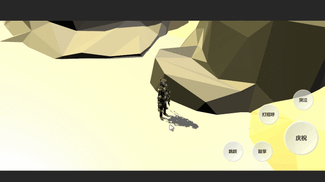
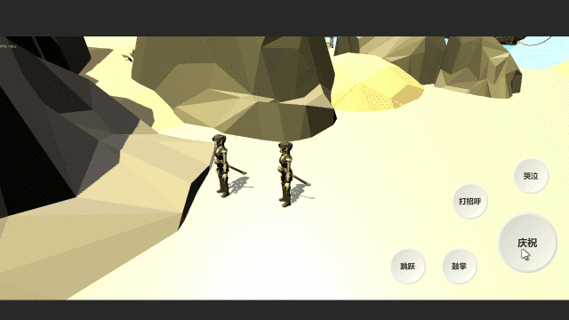

# Uquick SDK

前言：

元宇宙（Metaverse），是人类运用数字技术构建的，由现实世界映射或超越现实世界，可与现实世界交互的虚拟世界，具备新型社会体系的数字生活空间。而目前我们面对的是很多的一种概念型的资本炒作，为了改变这种现状，让概念变成现实，请我们携起手来，共同用代码来改变世界，加油元宇宙的创造者。

介绍：

Unity3d元宇宙和MMO游戏的快速开发方案，支持冷更新+热更新、微信登录、帧同步、状态同步，其主要思想借鉴于[JEngine](https://github.com/JasonXuDeveloper/JEngine)和[NoahGameFrame](https://github.com/ketoo/NoahGameFrame)。提供了MMORPG运行的demo，该demo服务端框架: [Squick](https://github.com/i0gan/Squick)

默认支持Android平台热更，IOS未做测试，不建议采用该框架对PC端进行热更，PC热更完全没必要，我也开发了一个专门更新PC端的工具，你可以采用原生开发的方式，不用管任何的热更框架，都可以实现类热更。项目地址：[QuickUpdater](https://github.com/pwnsky/QuickUpdater)

快速入手Uquick，请查看[快速开始](./Docs/QuickStart.md)

有任何编译问题，请加入讨论QQ群：729054809

介绍视频: https://www.bilibili.com/video/BV1kR4y197Xf

---

## 文档

文档正在极速更新之中。

[快速开始](./Docs/QuickStart.md)

[Uquick项目结构介绍]

[热更脚本的绑定]

[如何对Android平台进行冷更]

[如何对Windows平台进行热更]

[Squick SDK介绍]

[Squick 插件介绍]

[Squick 动画系统介绍]

[Squick 网络协议介绍]

## 特性

使Unity开发的游戏支持热更新的解决方案

仅需下载并打开框架，就可以开始制作可热更新的游戏，无额外硬性要求。

框架进行了集成以及完善的封装，无需关注热更原理即可使用强大的功能。

动画系统同步

位置、旋转同步

场景对象基本信息同步

**Demo在线下载**：

若无法点击下载，请复制URL到浏览器中进行下载

安卓下载 :  http://tflash.pwnsky.com:22220/dlc/application.apk 

### 公益软件上线案例

该软件中，使用了Uquck的冷热更框架，让其移动App更新变得简单。

智慧岐黄科普版：https://tflash.pwnsky.com

智慧岐黄专业版：http://tflash.pwnsky.com

## 将来要做

支持更快速的KCP协议做帧同步

支持更丰富的元宇宙玩家互动

支持多场景切换

支持聊天功能

支持智能导航系统

支持WebRTC支持实现元宇宙实时查看直播

支持Pico SDK接入，让该项目更好的适配国产VR设备。

### 热更+冷更：

更新过程：

冷更新 -> 热更新。

冷更新：

开始的先检查apk版本，如果当前版本为老版本，则下载远程新的apk进行安装。如果已达到最新版本的apk，则继续热更新。

热更新：

本地资源与远程资源进行crc校验，如果本地的crc与远程不同或没有，则下载远程的资源到本地，之后再加载资源即可进入游戏。

下面测试是在安卓手机上测试，完美冷更+热更。

**热更界面**

### MMO

提供了一个小的MMORPG 运行Demo，服务端采用[Squick](https://github.com/i0gan/Squick)开发的，可以支持多人玩家在线，场景的对象状态同步，帧同步，以及人物动画同步等等，之后更多特性不断更新中。下面例子的服务器是在公网上进行连接MMO测试的，客户端一个运行在编辑器，另一个运行在安卓端。

**位置移动同步**

**动画同步**

## 该项目开发环境

### Windows（推荐）

- Unity版本：2020.3.34f1 （请使用该版本及以上）
- Unity工程.net环境： .Net Framework 4.8
- 热更工程.net环境： .Net Framework 4.8

### Arch linux

* Unity版本：2022.3.34f1 

* Unity工程.net环境： .Net Framework 6.0

* 热更工程.net环境： .Net Framework 6.0

## 一些很赞的项目

JEngine

- 作者: ketoo
- Github:  https://github.com/JasonXuDeveloper/JEngine
- 描述: 简单轻量的c#脚本热更框架

ET

- 作者: egametang
- Github:  https://github.com/egametang/ET
- 描述: 游戏客户端（基于unity3d）服务端双端框架，服务端是使用C# .net core开发的分布式游戏服务端。

NoahGameFrame

- 作者: ketoo
- Github:  https://github.com/ketoo/NoahGameFrame
- 描述: 基于插件的跨平台网络服务器框架

