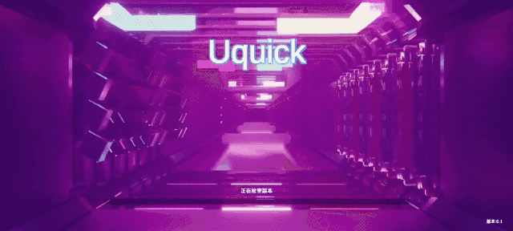
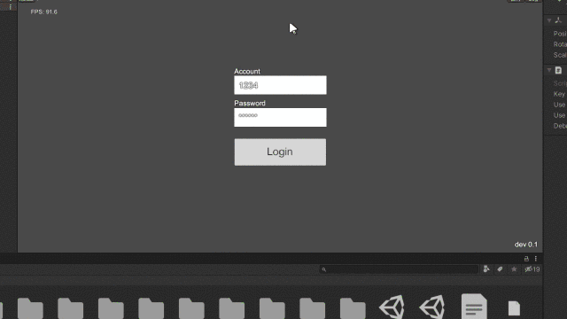
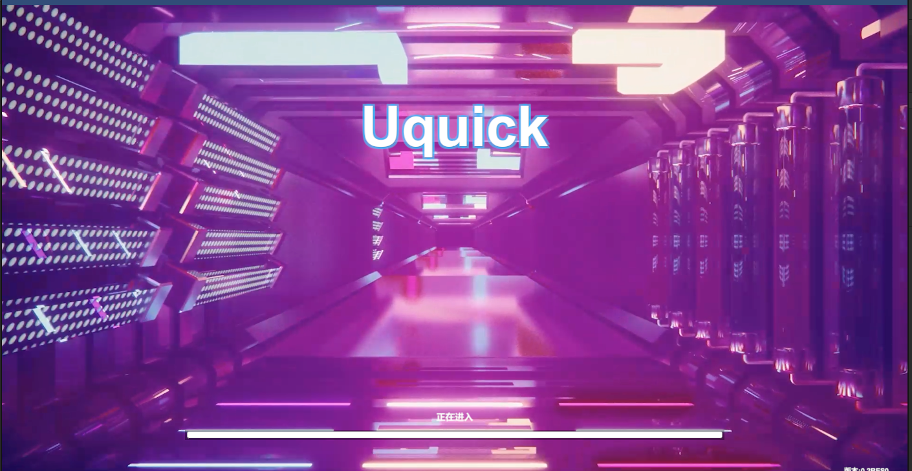

# Uquick SDK

Uquick是一款基于[JEngine](https://github.com/JasonXuDeveloper/JEngine)热更的框架二次开发的MMO Unity快速手游开发解决方案，增加了冷更新，IL2CPP的优化，编译插件的优化，提供了MMORPG运行的demo，该demo服务端框架: [Squick](https://github.com/i0gan/Squick)

默认支持Android平台热更，IOS未做测试，不建议采用该框架对PC端进行热更，PC热更完全没必要，我也开发了一个专门更新PC端的工具，你可以采用原生开发的方式，不用管任何的热更框架，都可以实现类热更。项目地址：[QuickUpdater](https://github.com/pwnsky/QuickUpdater)

讨论QQ群：729054809

## 特性

使Unity开发的游戏支持热更新的解决方案

仅需下载并打开框架，就可以开始制作可热更新的游戏，无额外硬性要求。

框架进行了集成以及完善的封装，无需关注热更原理即可使用强大的功能。

麻雀虽小五脏俱全，框架只有基础流程需强制遵循，其他功能可按需使用。

动画系统同步

位置、旋转同步

场景对象基本信息同步

**Demo在线下载**：

[安卓下载](http://tflash.pwnsky.com:22220/dlc/application.apk)

## 将来要做

采用更快速的KCP协议做帧同步

支持更多角色以及动画

支持多世界

支持聊天功能

AI Boss多玩家对战

智能导航系统

### 热更+冷更支持：

更新过程：

冷更新 -> 热更新。

冷更新：

开始的先检查apk版本，如果当前版本为老版本，则下载远程新的apk进行安装。如果已达到最新版本的apk，则继续热更新。

热更新：

本地资源与远程资源进行crc校验，如果本地的crc与远程不同或没有，则下载远程的资源到本地，之后再加载资源即可进入游戏。

下面测试是在安卓手机上测试，完美冷更+热更。

### MMO支持

提供了一个小的MMORPG 运行Demo，服务端采用[Squick](https://github.com/i0gan/Squick)开发的，可以支持多人玩家在线，场景的对象状态同步，帧同步，以及人物动画同步等等，之后更多特性不断更新中。下面例子的服务器是在公网上进行连接MMO测试的，客户端一个运行在编辑器，另一个运行在安卓端。

## 开发环境

- Unity版本：2020.3.34f1 （请使用该版本及以上）
- U3D工程.net环境： .Net Framework 4.x
- 热更工程.net环境： .Net Framework 6.x

## 打开方式

采用Unity打开 Untiy目录即可。模板自带IL2cpp模式，

## 目录结构

> 该结构是UnityProject目录内的结构，非热更工程的目录结构都可以凭个人喜好决定是否遵守

#### Unity工程

- Assets

  \- Unity工程根目录

  - **Dependencies** - JEngine用到的一些第三方插件，更新时替换该目录内相关的插件

  - HotUpdateResources

    \- 所有热更资源将存放在这里

    - AddOns

      \- 分包

      - **AddOn1** - 分包1

    - **Controller** - 动画

    - **Dll** - 该目录存放热更代码

    - **Material** - 材质

    - **Prefab** - 预制体

    - **Scene** - 场景

    - **ScriptableObject** - Unity的可程序化物件

    - **TextAsset** - 文本资源

    - **UI** - 图片资源

    - **Other** - 其他任意东西，只要能被加载的都可以丢在这里

  - Scripts

    \- 无法热更新的代码

    - **InitUquick.cs&LoadILRuntime.cs** - **十分重要**的文件，用于启动游戏
    - **Helpers** - 助手类文件夹，包含ILRuntime注册代码
    - **Adapters** - 适配器类文件夹，生成ILRuntime适配器后会创建此文件夹，包含ILRuntime的适配器，用于热更工程继承本地接口和类
  
  - **Init.unity** - 启动游戏的场景

#### 生成目录

- **DLC** - 生成的客户端资源和热更资源导出的目录
- **EncryptsAssets** - 加密热更资源导出目录

#### 热更代码目录

- HotUpdateScripts

  \- 热更代码项目

  - **Program.cs** - 启动游戏的代码, **你可以更改里面的东西，但请不要删除或更改该脚本的SetupGame和RunGame方法**

  - Uquick

    请勿删除Uquick部分源码在里面，

    每次更新覆盖该目录

## 快速开始

### 打开项目

1. 将项目的**Unity目录用Unity打开**
2. 首次打开会生成个**lock文件**到Assets目录下，**请勿删除**
3. 找到**HotUpdateResources/Scene**, 确保你能找到**Game.unity**，并且**HotUpdateResources/DLL/~Hidden文件夹中有生成的DLL文件（这个文件夹Unity内看不见）**
4. 第一次导入会出现报错，点击忽略进入项目后，切换平台至安卓即可。
5. 可直接点击运行Demo

查看控制台，出现打印了Hello World!

这条语句的输出是在热更脚本里输出的。

### 修改热更脚本

1. 打开热更工程了，也就是`path/to/Uquick/Unity/HotUpdateScripts`目录，用IDE（推荐vs或rider，因为vscode需要自己配dotnet build来编译）打开里面的sln文件，打开Game/AppStart.cs文件，在里面Awake增加你的日志，然后编译。默认该脚本Awake里有个Hello World!，在热更完毕进入`Assets/HotUpdateResources/Scene/AppStart.unity` 场景后会调用该函数，该脚本文件绑定在此场景中的AppStart里，采用Class Bind来进行绑定的。

### 编译热更资源

将热更脚本还有热更资源全部编译为Unity的ab文件。

1. 尝试打包热更资源，记得部署资源，点击`Tools/BuildAsset/构建Assetbundle`

### 打包apk

1. 执行CLR绑定（菜单栏，`Uquick/ILRuntime/CLR Bind`），这一步不做的话在IL2CPP出包后必定出问题
2. 修改热更资源服务器IP，打开Assets/Init.unity场景，选择Updater，属性面板中出现BaseURL，将其填写为你的资源服务器，比如`http://ip:port/DLC/`
3. 尝试打包游戏（APK）点击`Tools/BuildAsset/Build Android`在Unity项目下的DLC下回出现application.apk，还有些热更资源文件

### 部署热更资源文件

1. 将热更资源文件以及apk文件 (DLC下的所有文件)上传自http服务器，直接上传DLC文件即可。保证http的根目录下有DLC目录。

### 完毕

1. 采用手机安装运行看看效果。之后就可以将自己的热更资源丢入Assets/HotUpdateResources/下对应的目录了，采用热更脚本来实现资源的管理或游戏逻辑。

## 概念介绍-运行模式

提示

Uquick可以使用三种模式运行游戏，分别是：开发模式，离线模式，真机模式

1. 开发模式

   1. 直接编辑器下运行游戏
   2. 尝试修改热更代码并编译，或修改热更资源，回到步骤1，尝试实现热更

2. 离线模式

   1. 打出AB包
   2. 在Unity编辑器菜单栏选择Tools/BuildAsset/Copy资源到StreamingAssets
   3. 控制台输出复制成功后，进入Init场景，将`Updater`的`Mode`设置为`Local`
   4. 尝试运行游戏
   5. 尝试修改热更代码并编译，或修改热更资源，回到步骤1，尝试实现热更

3. 真机模式

   1. 打出AB包

   2. 在资源服务器上创建DLC目录

      - 如果未开启AB加密（默认），就将UnityProject/DLC内的文件上传到资源服务器的DLC目录下
      - 如果开启了AB加密（需要自己配置），就将UnityProject/EncryptAssets内的文件上传到资源服务器的DLC目录下

   3. 进入Init场景，将将`Updater`的`Mode`设置为`Build`

   4. 将`Updater`的`BaseURL`设置为`http(s)://资源服务器地址/DLC`

   5. 尝试运行游戏

      提示

      - 资源服务器上创建的目录名字可以随意，但是`Updater`的`BaseURL`的地址必须是服务器上创建的文件夹的名字结尾
      - 不论资源服务器上创建的目录是什么名字，打包热更资源后都应该根据是否使用加密将`UnityProject/DLC`或`UnityProject/EncryptAssets`下的文件上传上去
      - 如果打了AB后通过菜单栏工具将其复制到了`StreamingAssets`，那么真机模式下会基于`StreamingAssets`内的资源进行增量热更

   6. 尝试修改热更代码并编译，或修改热更资源，回到步骤1，尝试实现热更