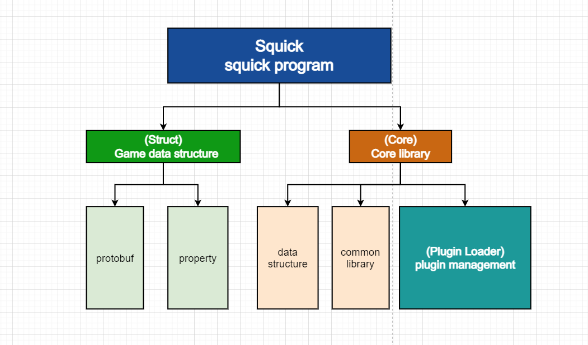
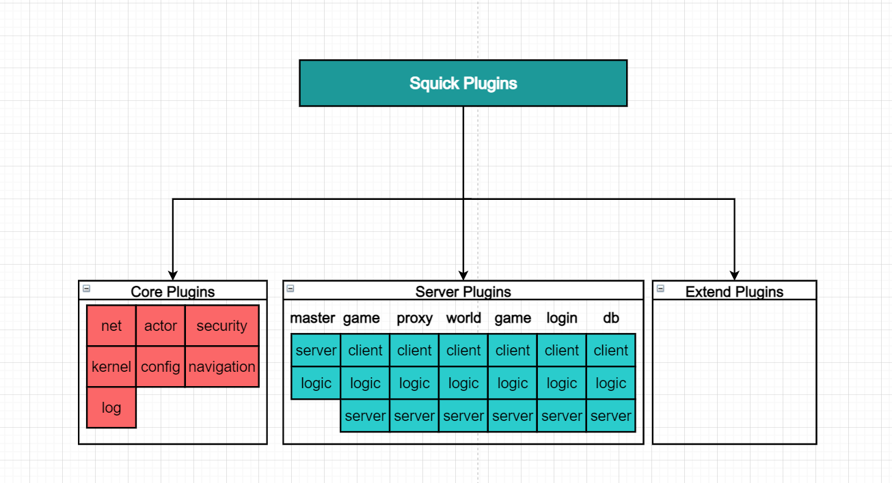

# Squick介绍

## 前言

元宇宙，是人类运用数字技术构建由现实世界映射或超越现实世界的一种可与现实世界交互的虚拟世界，它具备了新型社会体系的数字生活空间。而目前我们面对的是很多的一种概念型的资本炒作，为了改变这种现状，让概念变成现实，请我们携起手来，共同用代码来改变世界，加油勇敢的元宇宙的创造者们。

## Squick是什么?

Squick是元宇宙、MMO游戏C++服务器快速开发方案，支持局部热重载、插件化开发、与客户端实现帧同步，可快速开发元宇宙、MMO游戏项目等。其主要开发思想源于[NoahGameFrame](https://github.com/ketoo/NoahGameFrame)。

客户端Demo: [Uquick](https://github.com/i0gan/Uquick)

**讨论QQ群：739065686**

**视频介绍**: https://www.bilibili.com/video/BV1kR4y197Xf


## 特性

- 采用动态连链接库方式动态加载插件，开发拓展插件，让开发服务器变成开发插件
- 插件化管理方式，可对插件进行加载与卸载实现不用关掉程序，就可以实现热重载功能。
- 遵守谷歌C++编程规范
- 事件和属性驱动，让开发变得更简单
- Excel文档配置
- 日志捕获系统
- 支持部分不用停服即可热更，动态实现替换插件
- 默认拥有服务器插件：代理服务器、世界服务器、导航系统、数据库服务器、中心服务器、登录服务器
- 分布式服务、各服务之间通过网络来进行沟通，可通过分布式+集群方式减轻服务器压力
- 拥有协程异步、事件与属性驱动，提升开发效率
- Lua热更新、热重载、lua脚本可管理c++插件以及lua插件。通过lua可以动态热更新c++层面的插件(.so文件)，实现lua热更以及c++ native层的热更新。
- 采用Redis + Mysql作为数据库，通过数据库服务器，让数据灵活存储。
- 拥有后台管理系统，采用 vue-element-admin 前端框架编写后台管理系统前端，master server作为后台管理系统接口服务。
- 跨平台编译：支持Windows编译与Linux编译


## Squick核心架构

程序结构



采用加载不同插件方式来实现不同服务功能，都可适合小、中、大型团队人员进行同时开发，各自只需将自己的功能封装到自己的插件里，通过模块接口实现跨插件调用，提高开发效率。


# Squick的基本知识

搭建服务端，请查看 [搭建教程](./快速搭建.md)

## 项目结构

该工程项目结构如下：

```
deploy:   // 服务端生成可部署文件
config:   // 服务端配置
data:     // 服务程序储存数据
bin:      // 服务端程序   
tools:    // 工具
src:          // 主要源码文件夹
	lua:      // lua脚本代码
    server:   // 各服务器代码
    squick:   // 核心代码
    tester:   // 测试代码
    tools:    // 工具代码
    tutorial: // 教学示例代码
    test:     // 测试代码
    proto:   // protobuf代码
    www:          // 网站系统代码
    	admin:    // 后台前端代码
    	server:   // web服务端代码
    	website:  // 官网前端代码
third_party:  // 第三方代码
cache:        // 编译时的临时文件
others:       // 其他
```


## 代码命名规范

遵循google c++开发规范。

ref: https://blog.csdn.net/qq_41854911/article/details/125115692


## 插件系统

Squick当前所有重要插件如下：





插件与模块的关系


每一个插件为一个动态链接库文件（.so文件），将功能代码封装为插件的模块，可通过插件来加载各个插件的功能模块。

每个插件可以包含一个或多个模块


## 热更新基本原理

#### Lua脚本热更新

程序会监控支持热重载的lua脚本的更新日期，新更改的文件或增加的文件，会对这些lua脚本重新加载，而数据全存储在数据库服务器上，从而达到动态更新服务端逻辑。只能对登录服务器、游戏服务器、世界服务器进行热重载。

#### c++插件 热更新

在更新新插件时，通过中央服务器对每一个子被更新的服务器进行进程环境保护，缓存代理服务器上客户端的请求包，等待被更新的服务端计算完毕之后，对其响应包进行缓存，在被监控的服务器处于安全空闲状态的时候，将其被更新的插件的所有模块安全卸载掉，重新加载新的插件进来，通知中央服务器然后继续运行，中央服务器再通知所有代理服务器，继续转发请求包。


## 插件状态调用顺序

``` 
SquickPluginLoad -> 插件构造函数 -> Install -> Uninstall -> 插件析构函数-> SquickPluginUnload
```

## c++模块状态调用顺序

```
模块构造函数 -> Awake -> Start -> AfterStart -> ReadyUpdate -> Update -> BeforeDestory -> Destory -> Finalize -> 模块析构函数
```

### Lua模块调用状态顺序

```
awake -> init -> after_init -> before_destry -> destry
```

## 概念

### Module(模块)

表示一类逻辑业务的合集, 相对来说功能比较集中, 可以做到低耦合, 并且可以通过`IOP`(面向接口编程)的方式来给其他模块提供耦合功能.例如LogModule等.

### Plugin(插件)

表示一系列Module的集合, 按照更大的业务来分类, 例如GameLogic插件, Navimesh插件等.

### Application(应用)

表示一个独立的完整功能的进程, 可以包含大量插件, 例如squick等.

### DataList

表示一维数据, 通常用来表示Entity附带的任意一维数据结构, 当前可以为常用内置数据类型(`bool` `int` `int64` `double` `float` `string` `GUID`). 例如`PlayerEnity`附带的HP MP等数据.

### Record

表示二维数据, 通常用来表示Entity附带的任意二维数据结构,结构与Microsoft Excel的二维结构类似, 包含`Row`和`Column`, 并且结构可以通过Excel动态传入, Table中任意Cell可以为常用内置数据类型(`bool` `int` `int64` `double` `float` `string` `GUID`). 例如`PlayerEnity`附带的`ItemTable`.

### Property

表示游戏内动态创建的任意实体对象, 该实体对象通常携带大量`DataList`和`Record`

### GUID

表示游戏内唯一ID, 并且全区全服不重复, 可以用来做`Property ID`等游戏内有唯一性需求的ID.

### Object Event(对象事件)

游戏逻辑监听和产生事件, 用来解耦游戏逻辑.


## 上手Squick

文档正在极速更新中

### 快速开始

[快速搭建](./快速搭建.md)

[调试](./调试.md)

### 知识概念

[代码风格框架]

[插件和模块]

[动态插件](./动态插件.md)

[热数据属性]

[数据驱动编程]

[异步机制]

[服务器架构](./服务架构.md)

[场景机制]

[热更新](热更新.md)

[状态同步原理]

[帧同步原理]

[网络协议]

[导航原理]

[服务器配置文件]

[日志配置文件]

[工具]

### 代码实例

[如何编写新的插件]

[如何使用属性机制]

[如何使用事件机制]

[如何使用异步机制]

[如何写http服务器]

[如何调用redis接口]

### 运营管理

[如何管理Squick进程]

[如何实现局部热重载]

