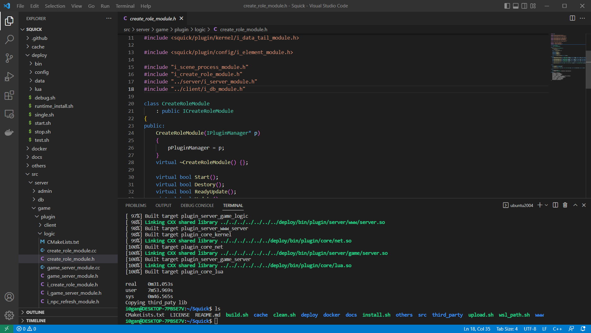

# 快速开始


## 开发环境用户建议

### Windows环境用户

调试开发推荐采用VS来进行编译开发， 请查看[Windows编译 ](#Windows编译)，如果想在自己的Windows上实现跨平台编译Linux程序，也不想安装虚拟机来进行开发，推荐你安装WSL2，安装一个Ubuntu 20系统，之后采用linux子系统 选择[直接编译 ](#直接编译)了。

那么如果你想更改代码，又用不来vim，你在wsl里项目根目录下运行

```sh
bash open_explorer.sh
```

会打开文件浏览器，选择当前的上级目录，安装一个Vs code，直接采用Vs code来编辑代码吧。在Vscode中开启Terminal，在输入bash，即可切换到WSL，可以很方便的敲命令编译了。如下：




### Linux环境用户

你可以直接任意选择你自己喜欢的开发方式，可以采用CMake生成 VS或Qt工程，采用Rider或Qt来打开工程。


## Linux编译

[一键docker编译](#一键docker编译)

[共享docker编译 ](#共享docker编译 ) (推荐)

[直接编译](#直接编译)


默认编译的是debug版本，如果想编译为release版本，请打开{project_path}/build.sh，在第8行的Version改为release即可。在编译的时候，会在项目根目录下创建一个cache文件夹来存储编译时生产的临时中间文件。


### 一键docker编译

已测试：测试时间：2022-11-19 22:13

采用的是ubuntu:20.04环境来进行编译的。采用该方法，是为了验证编译环境或快速部署。编译的工程文件是从github中新下载下来的，下载到容器里的/root目录。

docker安装方法，这里就不用说了，只需一步就可以搭建编译环境以及编译。一键编译。

```sh
cd docker/dev/build/ && docker build -t squick .
```

编译完成后

```sh
cd {project_path}
docker run -it --name=squick --net=host -v `pwd`:/mnt squick
```

进入容器后

```sh
cd ~/Squick/deploy
./single.sh # 运行
```

如果运行成功，访问 http://127.0.0.1:8080/admin ，如果能够看到登录界面，那么编译没问题，运行`./stop.sh` 脚本退出。


### 共享docker编译

**推荐**

#### 创建容器

这种是方式编译，懒得自己搭建开发环境，也是为了方便开发，让编译文件与开发文件直接映射，采用的是ubuntu:20.04环境来进行编译的。

```sh
cd {project_path}
cd docker/dev/ && bash creat.sh
```

#### 进入容器后

```sh
cd /mnt && bash clean.sh
cd /mnt && chmod +x build.sh && chmod +x third_party/build.sh

# 编译squick 第三方库
cd /mnt/third_party && bash ./build.sh

# 编译squick代码
cd /mnt/ && bash ./build.sh

# 编译后台管理前端vue代码
git config --global url."https://".insteadOf git://
cd /mnt/www/admin && npm install
# 安装第三方库依赖
cd /mnt/third_party/build/drogon && make install

# 编译web代码，包含后台管理前端代码、服务器代码、网站前端代码等。
cd /mnt/www && bash ./build.sh
```

#### 测试运行

```sh
cd /mnt/deploy && ./single.sh # 运行
```

如果运行成功，访问 http://127.0.0.1:8080/admin ，如果能够看到登录界面，那么编译没问题，运行`./stop.sh` 脚本退出。


### 直接编译

采用物理机编译是为了开发以及测试更加方便。但可能需要你们自己手动配置各种搭建环境时出现的问题。

#### 编译squick

克隆代码

```
git clone https://github.com/pwnsky/Squick.git
```

或者直接点击 https://github.com/i0gan/Squick/archive/refs/heads/main.zip 下载代码。

下载之后，解压进入，执行

```bash
cd Squick
bash install.sh
```

install.sh脚本会自动下载编译工具，并且编译，如果出现不能编译，可能是缺少是依赖，linux依赖包如下：

```
git cmake unzip automake make g++ libtool libreadline6-dev libncurses5-dev pkg-config libssl-dev
nodejs npm libjsoncpp-dev uuid-dev zlib1g-dev
```

请采用手动进行安装以上工具包。

#### 编译第三方库

```sh
cd {project_path}/third_party
bash build.sh

# 安装drogon库
cd build/drogon
sudo make install
```

#### 编译squick

```
cd {project_path}/third_party
bash build.sh
```

#### 安装Web后台前端代码依赖

```sh
cd {project_path}/www/admin
npm install
```

如果node js 版本> 17，在安装依赖时或编译时，记得加环境变量

```sh
export NODE_OPTIONS=--openssl-legacy-provider
```

#### 编译Web代码

编译后台管理vue前端代码、后台服务器代码、网站vue前端代码。

```sh
cd {project_path}/www
bash ./build.sh
```

#### 测试运行

```
cd {project_path}/deploy && ./single.sh # 运行
```

如果运行成功，访问 http://127.0.0.1:8080/admin ，如果能够看到登录界面，那么编译没问题，运行`./stop.sh` 脚本退出。


### 编译后

编译完成后，在`{project_path}/deploy/bin` 下会出现编译好的二进制文件。如下

```
deploy/bin/
├── lib
...
│   ├── squick_core.so
├── plugin
│   ├── core
│   │   ├── actor.so
...
│   └── server
...
└── squick
```

编译成功后，可执行文件是在 ./deploy/bin/squick

在执行install.sh或其他方式编译成功后，后续不用执行之前的方式进行编译了，只需执行`{project_path}/build.sh` 脚本，采用docker编译的，在容器里执行即可。

```bash
./build.sh
```


## Windows编译

下载基本包并安装

**cmake**

下载 https://cmake.org/download/


### 第三方库编译

#### 直接用编译好的lib

将 {project_path}/builded 拷贝为  {project_path}/build 即可不用编译第三方源码

#### 源码编译

需下载依赖包，并安装到Windows中

**Win64 OpenSSL v3.0.7**

[EXE](http://slproweb.com/download/Win64OpenSSL-3_0_7.exe) | [MSI](http://slproweb.com/download/Win64OpenSSL-3_0_7.msi)


**MinGW**

编译lua需要，能编译出dll，但由于vc与gcc某些函数不兼容，导致squick程序的lua插件不能链接到该dll，需暂时借助第三方编译好的lua.lib来完成链接。

https://github.com/niXman/mingw-builds-binaries/releases


### 主工程编译

编译完或者处理第三方依赖库后，就可以直接对主工程源码进行编译了。

首先第一次编译时，先编译配置表工具，进入到工具目录下({project_path}/tools)，点击build_tools.bat即可编译。

之后再点击 generate_vs_project.bat 生成 vs项目工程在 {project_path}/cache下，打开{project_path}/cache/Project.sln 进行全部编译。

编译完成后，编译好的文件在 {project_path}/bin 下，需要点击 {project_path}/tools/init_runtime_dll.bat 脚本将依赖库拷贝过来，之后再 {project_path}/tools目录下点击 startall.bat 即可运行所有服务器。


编译完成后文件目录大致如下

```
.
├── event.dll
├── event_core.dll
├── event_extra.dll
├── lib
│   ├── squick_core.dll
...
├── libprotobufd.dll
├── plugin
│   ├── core
│   │   ├── actor.dll
...
│   └── server
│       ├── db
│       │   ├── client.dll
..
│       ├── game
...
├── squick.exe
..
```


## 搭建数据库

### 搭建Redis

这里采用docker来进行搭建，如果没有安装docker，请通过你分支下的包管理命令进行安装，Debian分支安装命令执行如下：

```
sudo apt install docker
```

拥有docker之后，需要得启动一下docker

```
sudo systemctl start docker
```

拉取redis镜像并创建运行redis容器

```
docker pull redis
docker run --name squick-cache -p 22222:6379  -d redis --requirepass indieleague # indieleague 是密码
```


### 搭建Mysql

更新中...


## 修改配置文件

采用Office软件打开{project_path}/resource/excel/side/NoSqlServer.xlsx，修改里面的IP为你搭建redis的ip，默认为127.0.0.1。修改完毕之后，需要重新生产配置文件，需执行一个脚本进行生成。linux执行如下：

```
cd {project_path}/tools
bash generate_config.sh
```

windows执行

```
cd {project_path}/tools
generate_config.bat
```


## 启动squick服务器

最后一步，可以通过前台启动或者后台启动方式来启动服务器，前台启动是将输出实时的输出到控制台，后台启动在控制台上是没有调试日志输出的。

在 {project_path}/tools目录下，`startall`脚本是前台启动所有服务器，这里采用前台启动。如果你想停止服务器，只需执行stopall脚本即可

linux执行

```bash
bash ./startall.sh
```

window执行

```
startall.bat
```


## Docker快速搭建

更新中...

